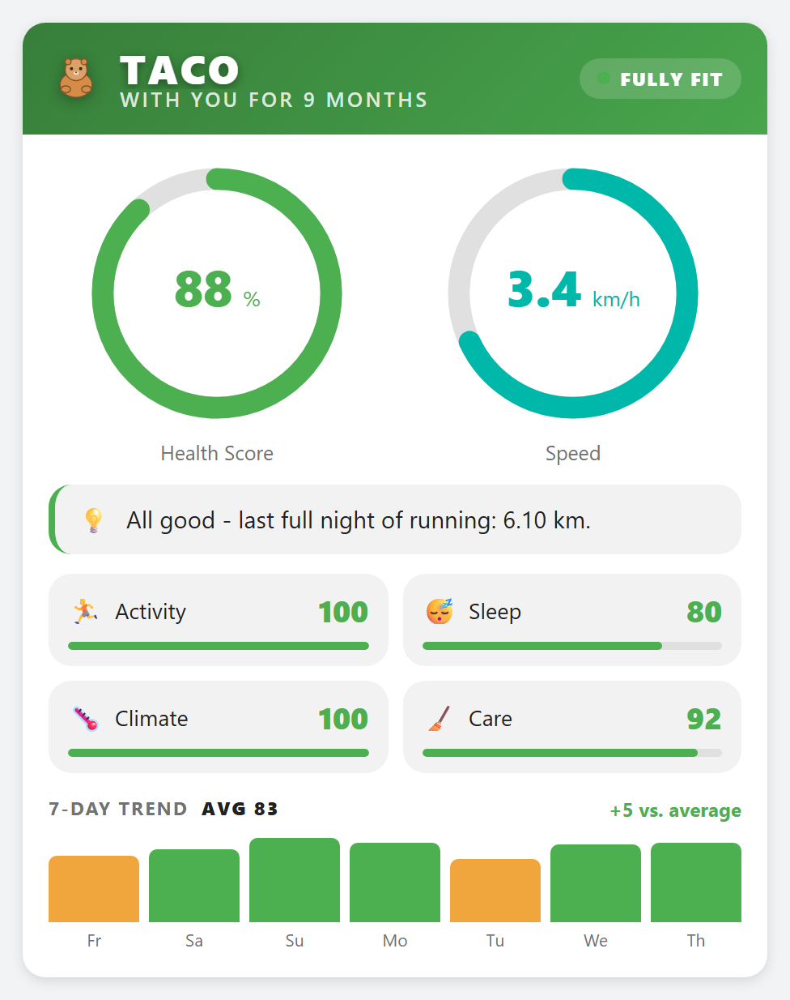
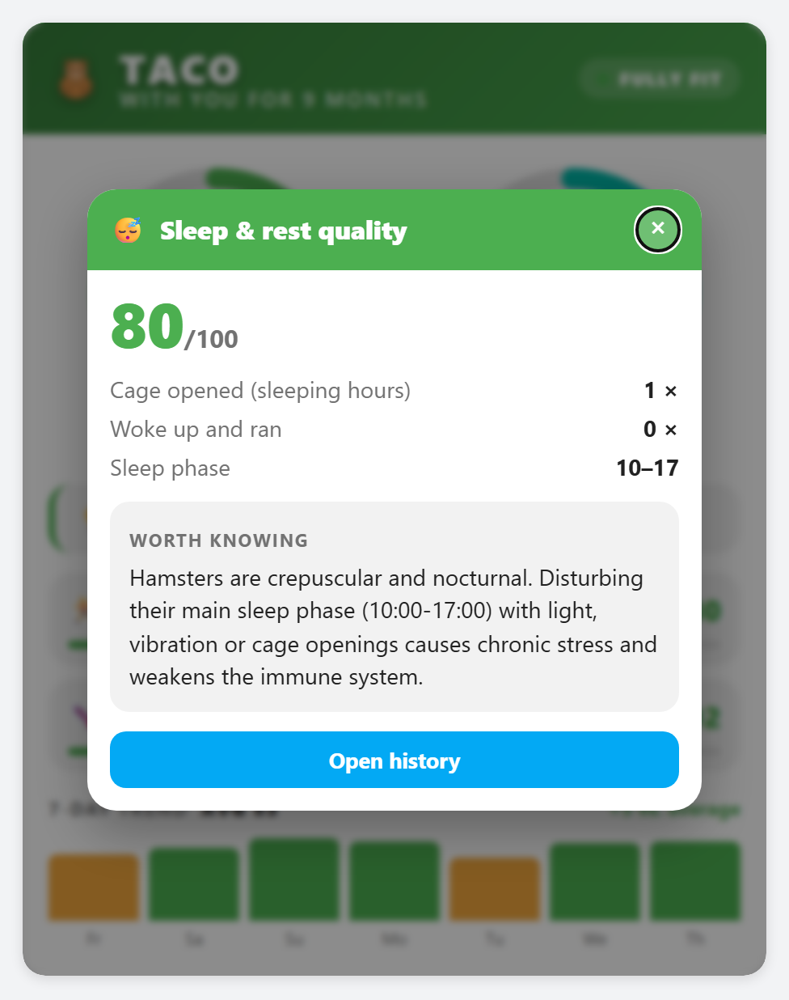
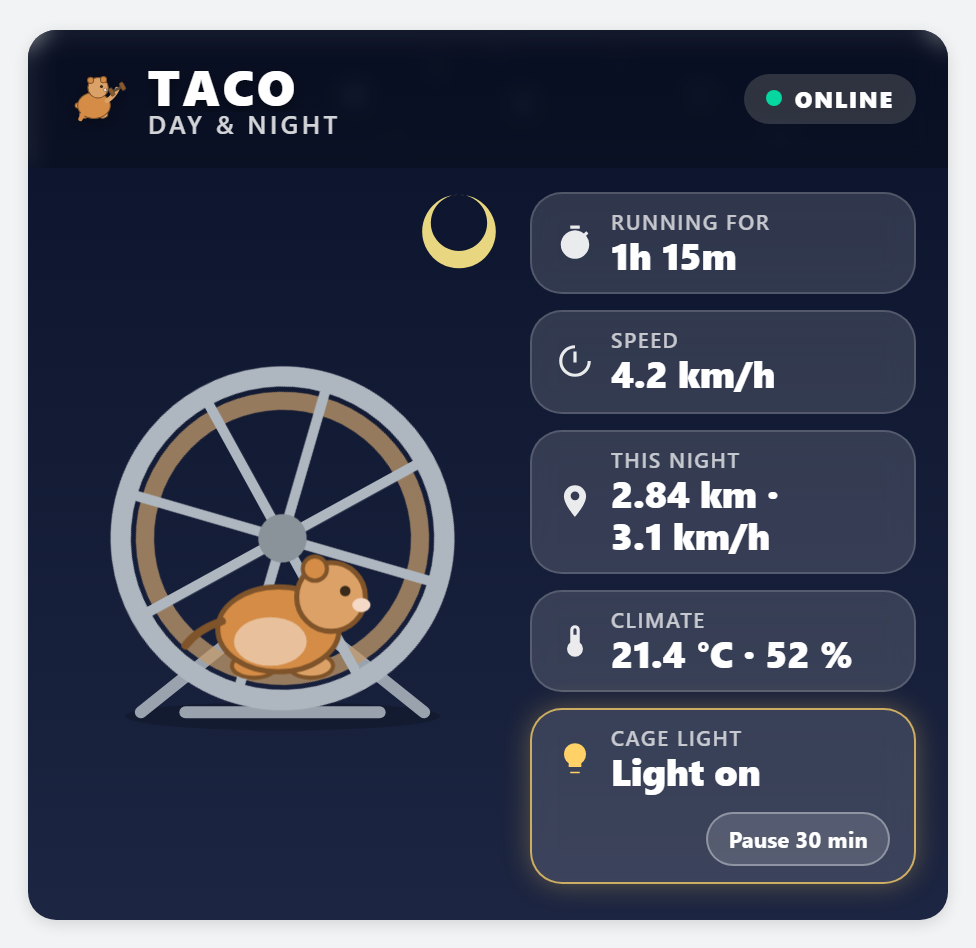
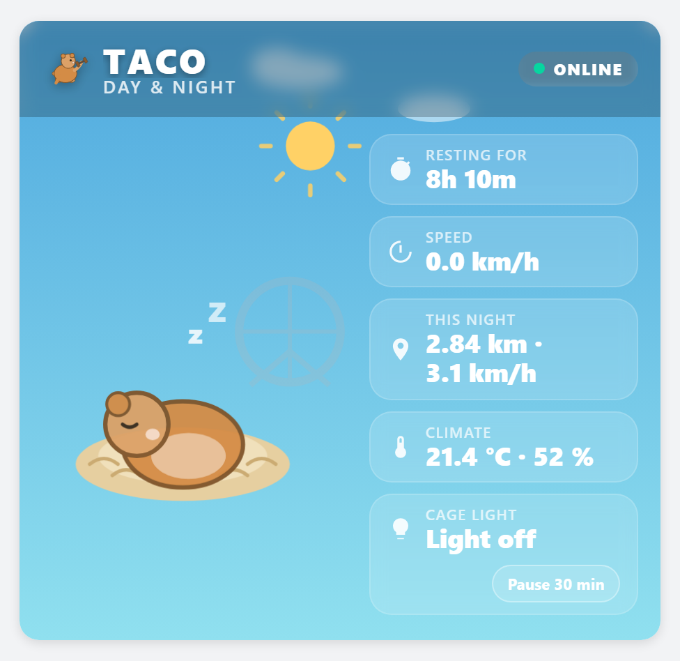
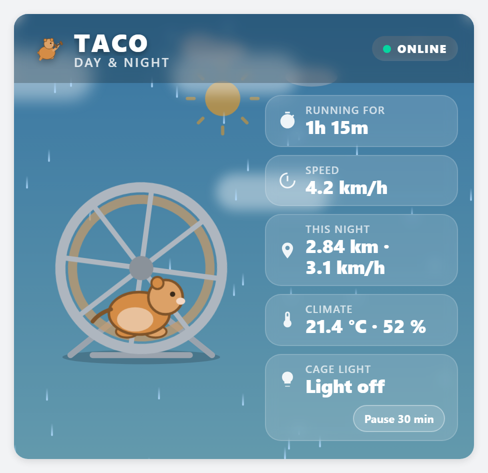
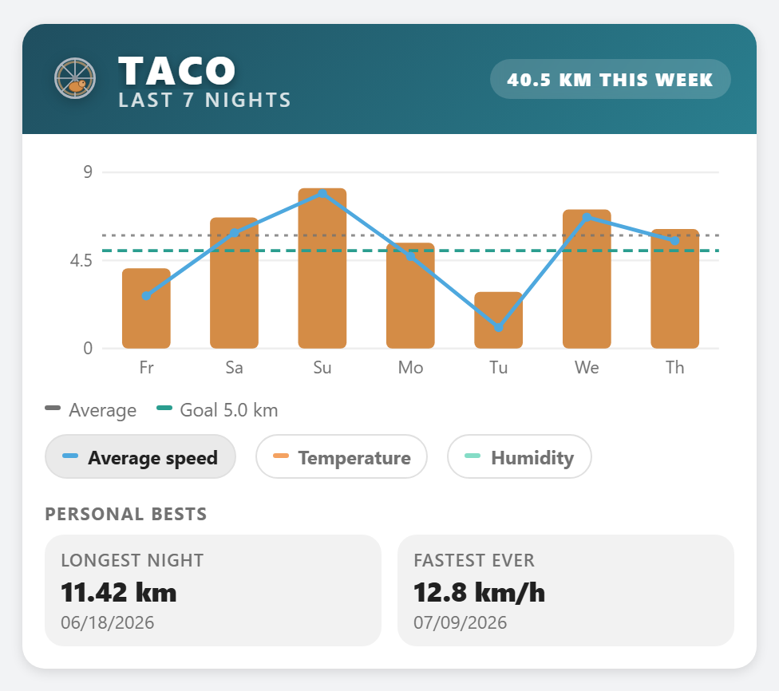
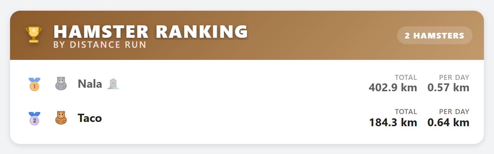
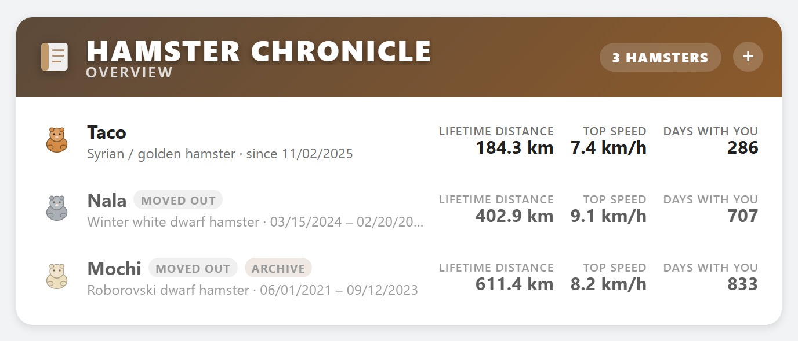
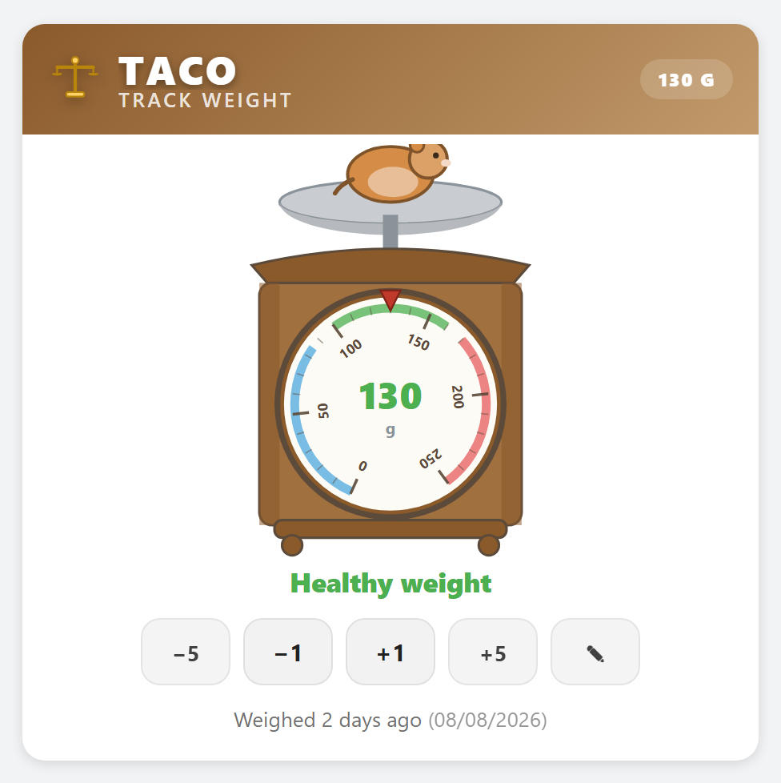
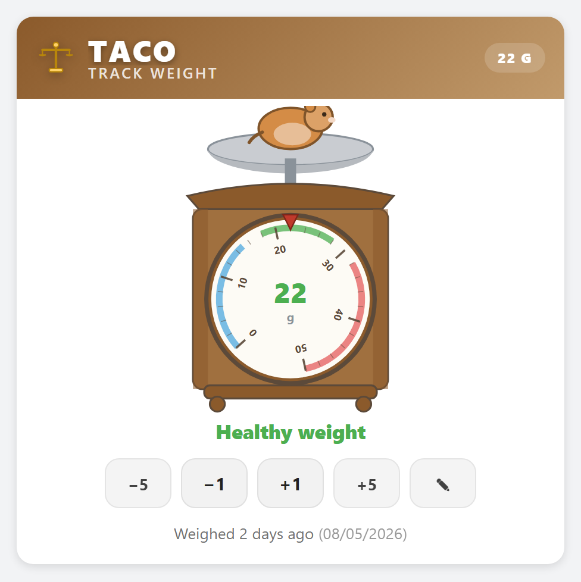

# Hamster Fitness — Integration (Software)

> **This is the software repository.** It contains only the Home
> Assistant integration (Python) and its Lovelace dashboard cards. The
> physical wheel sensor, 3D-printed parts, and ESPHome firmware live in a
> separate repository:
> **[hamster-fitness-hardware](https://github.com/GpsM2/hamster-fitness-hardware)**.

Hamster Fitness is a free add-on for Home Assistant. It watches your
hamster's running wheel, cage climate, and cage door, and turns that into
one health score you can actually act on — plus alerts, five dashboard
cards, and a cage light that switches itself on when you open the lid.

## Features

- **Health score** (0–100%) from four pillars: how far your hamster ran
  at night, how undisturbed it slept, the cage climate, and how regularly
  you look after it. Each pillar is its own sensor, so you can see *which*
  one is weak instead of guessing. Once you record a weight, how far it
  sits outside the healthy range for the breed counts too — until then it
  simply doesn't.
- **Distance and speed**: tonight, last night, today, lifetime total,
  current speed and top speed.
- **Activity tracking**: how long the current running session has lasted
  (short pauses under 30 minutes don't reset it), and how long your
  hamster has been resting since its last run.
- **Warnings and a daily summary** as push notifications, each
  independently switchable — plus an optional weigh-in reminder that only
  speaks up when weighing is actually overdue, and an optional heat
  reminder that looks at tomorrow's forecast rather than waiting for the
  cage to get too warm.
- **Cage light automation** with a proper on/off switch and a
  "pause for 30 minutes" button for cleaning day.
- **Hamster profile**: breed and coat colour, used to tint the
  illustrated hamster on the cards.
- **Lifetime history**: when a hamster moves out or passes away, its
  whole record is archived permanently — it stays in the chronicle even
  if you later delete the integration entry. Set the date by mistake?
  There's a button to undo it.
- **Boarding mode**: away at a foster home or the vet? Flip one switch
  and scoring, warnings and reminders pause until it's back, without
  archiving anything.
- **Six dashboard cards built in**, no extra downloads, all following
  Home Assistant's language (English and German):
  [Health Score](docs/cards/health-score.md) ·
  [Day & Night](docs/cards/day-and-night.md) ·
  [Running](docs/cards/running.md) ·
  [Ranking](docs/cards/ranking.md) ·
  [Chronicle](docs/cards/chronicle.md) ·
  [Track Weight](docs/cards/weighing.md)
- **Keeps the wheel diameter in sync** with your sensor device, so you
  never type the same number into two places.

## What you need

- Home Assistant 2026.3 or newer.
- A sensor that counts your hamster wheel's rotations. See
  [hamster-fitness-hardware](https://github.com/GpsM2/hamster-fitness-hardware)
  to build the small, cheap ESPHome-based one this project was designed
  around — a few euros in parts. Any other rotation counter works too.
- A temperature sensor and a door/lid sensor for the cage.
- Optional: humidity sensor, speed sensor, ambient light sensor, a
  weather entity, a moon phase sensor, and a cage light. Anything
  optional is simply skipped if you don't have it.

## Installation

### Step 1: Set up the wheel sensor

Skip this if you already have a working rotation sensor. Otherwise follow
the build guide in
[hamster-fitness-hardware](https://github.com/GpsM2/hamster-fitness-hardware);
once the ESPHome firmware is flashed, Home Assistant finds the device on
its own.

### Step 2: Install the integration

**Option A — with HACS** (once this repo is public and added to HACS):

1. Open HACS → Integrations → three-dot menu → "Custom repositories."
2. Add this repo's URL, category "Integration."
3. Find "Hamster Fitness" in HACS and install it.
4. Restart Home Assistant.

**Option B — manually:** copy `custom_components/hamster_fitness/` into
your Home Assistant `custom_components` folder and restart.

### Step 3: Set up your hamster

Go to **Settings → Devices & Services → Add Integration** and search for
"Hamster Fitness." You'll be asked for:

- your hamster's name, the date it moved in, its breed and coat colour,
  and the wheel diameter (the number on the wheel's packaging — the same
  one you entered in the ESPHome sensor, if you built one);
- then the sensors that feed it: wheel rotations, temperature and
  cage/lid sensor are required, humidity, speed, ambient light,
  weather, moon phase, cage light, the wheel diameter sync target and
  notification targets are optional.

You can change all of it later without starting over — gear icon on the
device → "Reconfigure." The **Configure** button holds the fine-tuning:
ideal temperature range, minimum nightly distance, notification switches
and time, the weigh-in reminder, the heat reminder and its temperature
threshold, and the cage light's brightness, fade time and turn-off delay.

### Step 4: Add the cards

Open a dashboard → **Edit** → **Add card**, search for "Hamster Fitness"
and pick one. Each card's own page explains what it shows and how to
configure it:

| Card | What it's for |
|---|---|
| [Hamster Fitness: Health Score](docs/cards/health-score.md) | One hamster's wellbeing, in depth |
| [Hamster Fitness: Day & Night](docs/cards/day-and-night.md) | The illustrated live view |
| [Hamster Fitness: Running](docs/cards/running.md) | One bar per night for the last week, with goal, records and climate |
| [Hamster Fitness: Ranking](docs/cards/ranking.md) | All hamsters by lifetime distance |
| [Hamster Fitness: Chronik](docs/cards/chronicle.md) | Every hamster that ever lived here |
| [Hamster Fitness: Track Weight](docs/cards/weighing.md) | Entering the weight, on a kitchen dial scale calibrated to the breed |

## The cards

All six follow Home Assistant's language (English and German), including
number and date formatting, and tint their illustrated hamster with the
coat colour from its profile — so two hamsters on one dashboard never
look like the same animal.

### Health Score

The whole picture for one hamster: the score ring, a plain-language
*Smart Insight*, the four pillars as a tappable 2×2 grid, and a 7-day
trend of daily averages.

Tapping a pillar opens the numbers behind that score, plus a short
husbandry note explaining why it matters — so the card answers *why*,
not just *how much*:

### Day & Night

The live view. The hamster runs in its wheel while it is actually active
— the wheel's speed follows the real one — and sleeps in its nest when
it is not. The sky follows the sun's position independently, so a
hamster dozing at 2 a.m. is drawn asleep under a night sky rather than
running just because it is dark.

 

Pick a weather entity during setup and the weather drifts over the scene
too — all fifteen Home Assistant conditions, from drifting cloud to
lightning:

Every chip is tappable: the readings open their own entity, and the cage
light chip switches the lamp directly.

### Running

One bar per night for the last week, so a run can be read against the
nights around it rather than on its own. A goal line at your configured
minimum distance — the same number the health score grades against —
an average line, and the night's average speed drawn over the bars.

Temperature and humidity can be switched on as extra lines, averaged per
night, for the questions the distances alone can't answer — whether a
quiet week lines up with a warm spell, say. Underneath sit the personal
bests: the longest single night and the fastest speed ever, each with
the date it happened, neither capped to the seven nights on show.

### Ranking

Every hamster by lifetime distance, with the average distance per day
alongside the total — so a hamster that has only lived here two months
is not simply bottom of the list.

### Chronicle

Everyone who ever lived here, current and long since departed. Archived
hamsters keep their record even after the device is deleted.

### Track Weight

Weight is the one thing the integration cannot measure by itself. The
dial's range and its coloured bands come from the breed, because "97 g"
means healthy Syrian or dangerously fat Roborovski depending on the
animal:

 

Both hamsters above are a healthy weight — the scale, not the number,
is what differs.

### If something looks wrong after an update

Home Assistant caches translations and dashboard resources. After copying
in a new version, a reload is often not enough: **restart Home Assistant
completely** (Settings → System → Restart) and refresh your browser with
<kbd>Ctrl</kbd>+<kbd>Shift</kbd>+<kbd>R</kbd>. If a setup screen shows a
raw name like `wheel_diameter` instead of a proper label, that is almost
always the fix.

## Entities

Every entity is named after your hamster, so you can always tell where it
came from — e.g. `sensor.hamster_taco_health_score` for a hamster called
"Taco."

| Entity | What it shows |
|---|---|
| `sensor.hamster_<name>_health_score` | Overall health score (0–100%) |
| `sensor.hamster_<name>_activity_score` | Pillar: nightly running distance |
| `sensor.hamster_<name>_sleep_score` | Pillar: undisturbed daytime sleep |
| `sensor.hamster_<name>_climate_score` | Pillar: cage temperature |
| `sensor.hamster_<name>_care_score` | Pillar: how regularly the cage is opened |
| `sensor.hamster_<name>_night_distance` | Distance run tonight |
| `sensor.hamster_<name>_daily_distance` | Distance run today (resets 9 AM) |
| `sensor.hamster_<name>_lifetime_distance` | Total distance ever run |
| `sensor.hamster_<name>_current_speed`¹ | Current wheel speed |
| `sensor.hamster_<name>_max_speed_tonight`¹ | Fastest speed tonight |
| `sensor.hamster_<name>_active_duration` | How long the current running session has lasted |
| `sensor.hamster_<name>_rest_duration` | How long your hamster has been resting |
| `sensor.hamster_<name>_humidity`² | Cage humidity |
| `binary_sensor.hamster_<name>_warning` | On when something needs attention |
| `binary_sensor.hamster_<name>_cage_door` | Cage door open or closed |
| `switch.hamster_<name>_light_automation`³ | Cage light automation on/off |
| `switch.hamster_<name>_boarding` | Pause everything while the hamster is temporarily away |
| `date.hamster_<name>_departure_date` | Set this when the hamster moves out |
| `button.hamster_<name>_undo_departure` | Undoes a departure set by mistake |
| `number.hamster_<name>_weight` | Type in the hamster's weight (grams, up to 250) |

¹ Only if you picked a speed sensor. ² Only if you picked a humidity
sensor. ³ Only if you picked a cage light.

### Action

`hamster_fitness.pause_light_automation` stops the cage-light automation
from reacting to the door for a while (30 minutes by default) and re-arms
it by itself. Target the hamster's `switch.<name>_light_automation`
entity. The Day & Night card's button calls exactly this.

## Health score, in short

The score starts at 100 and loses points for too little running at night,
a cage that is too cold or too warm, a lid that hasn't been opened in
days, and disturbances during the main sleep phase (10:00–17:00). The
running distance is measured over the **night**, not the calendar day,
and always against the better of the current and the last completed night
— so the score never drops just because a new counting window started.

## License

[Apache License 2.0](LICENSE) — a permissive open-source license: anyone
may use, modify and distribute the code, including commercially, as long
as the license and copyright notice are kept. (The hardware repo uses a
different, non-commercial license — see its README.)

See also: [Legal & Safety Disclaimer](DISCLAIMER.md) — this project
tracks activity, it doesn't replace a veterinarian, and comes with no
warranty.

## Support this project

Hamster Fitness is free and always will be. If it's useful to you and you
want to say thanks, you can [buy me a coffee on Ko-fi](https://ko-fi.com/R8O124JOD1).
Not required — just appreciated.
